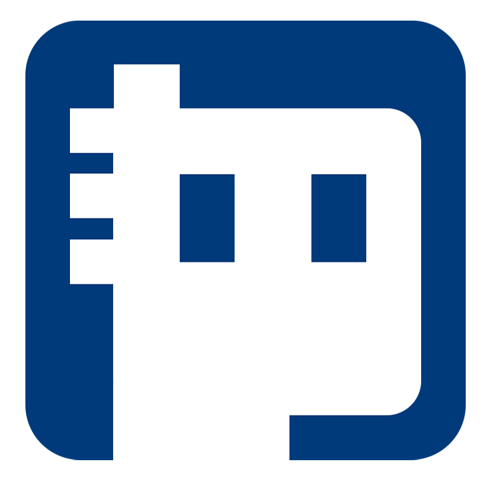

<!-- Improved compatibility of back to top link: See: https://github.com/othneildrew/Best-README-Template/pull/73 -->

<!--
*** Thanks for checking out the Best-README-Template. If you have a suggestion
*** that would make this better, please fork the repo and create a pull request
*** or simply open an issue with the tag "enhancement".
*** Don't forget to give the project a star!
*** Thanks again! Now go create something AMAZING! :D
-->

<!-- PROJECT SHIELDS -->
<!--
*** I'm using markdown "reference style" links for readability.
*** Reference links are enclosed in brackets [ ] instead of parentheses ( ).
*** See the bottom of this document for the declaration of the reference variables
*** for contributors-url, forks-url, etc. This is an optional, concise syntax you may use.
*** https://www.markdownguide.org/basic-syntax/#reference-style-links
-->

<!-- PROJECT LOGO -->
 

  

<h3 align="center">WHUpunk2023 Practice Contract</h3>

  

     
        Build with 
     
     
    <a href="https://github.com/qpdk777/WHUpunk2023-practice-contract">View Demo</a>
    ·
    <a href="https://github.com/qpdk777/WHUpunk2023-practice-contract/issues">Report Bug</a>
    ·
    <a href="https://github.com/qpdk777/WHUpunk2023-practice-contract/issues">Request Feature</a>
  

<!-- TABLE OF CONTENTS -->

  
Table of Contents

  <ol>
    <li>
      <a href="#about-the-project">About The Project</a>
      <ul>
        <li><a href="#built-with">Built With</a></li>
      </ul>
    </li>
    <li>
      <a href="#getting-started">Getting Started</a>
      <ul>
        <li><a href="#prerequisites">Prerequisites</a></li>
        <li><a href="#installation">Installation</a></li>
      </ul>
    </li>
    <li><a href="#usage">Usage</a></li>
    <li><a href="#roadmap">Roadmap</a></li>
    <li><a href="#contributing">Contributing</a></li>
    <li><a href="#license">License</a></li>
    <li><a href="#contact">Contact</a></li>
    <li><a href="#acknowledgments">Acknowledgments</a></li>
  </ol>

<!-- ABOUT THE PROJECT -->
## 关于本项目

本项目是武汉大学 Web3 俱乐部 WHUpunk2023 活动配套的练习合约，部署在 Sepolia Testnet 上，用于本次活动参与者的日常练习。

(<a href="#readme-top">back to top</a>)

## 预期功能

* 每日签到：参与每日签到积攒活跃度，并根据活跃度发放奖励
  
* NFT 集卡：

<table>
<thead>
  <tr>
    <th>系列</th>
    <th>集卡内容</th>
    <th colspan="2">集齐奖励</th>
  </tr>
</thead>
<tbody>
  <tr>
    <td>校训系列</td>
    <td>“自强”“弘毅” “求是”“拓新”</td>
    <td colspan="2">一张稀有级别NFT</td>
  </tr>
  <tr>
    <td>校名系列</td>
    <td>“国”“立”“武” “汉”“大”“学”</td>
    <td>一张稀有级别NFT</td>
    <td rowspan="2">全部集齐可获得一张至尊级别NFT</td>
  </tr>
  <tr>
    <td>牌坊系列</td>
    <td>“文”“法”“理” “工”“农”“医”</td>
    <td>一张稀有级别NFT</td>
  </tr>
</tbody>
</table>

* 模拟领取

<!-- LICENSE -->
## License

Distributed under the MIT License. See `LICENSE` for more information.

(<a href="#readme-top">back to top</a>)

<!-- MARKDOWN LINKS & IMAGES -->
<!-- https://www.markdownguide.org/basic-syntax/#reference-style-links -->
[contributors-shield]: https://img.shields.io/github/contributors/qpdk777/WHUpunk2023-practice-contract.svg?style=for-the-badge
[contributors-url]: https://github.com/qpdk777/WHUpunk2023-practice-contract/graphs/contributors
[forks-shield]: https://img.shields.io/github/forks/qpdk777/WHUpunk2023-practice-contract.svg?style=for-the-badge
[forks-url]: https://github.com/qpdk777/WHUpunk2023-practice-contract/network/members
[stars-shield]: https://img.shields.io/github/stars/qpdk777/WHUpunk2023-practice-contract.svg?style=for-the-badge
[stars-url]: https://github.com/qpdk777/WHUpunk2023-practice-contract/stargazers
[issues-shield]: https://img.shields.io/github/issues/qpdk777/WHUpunk2023-practice-contract.svg?style=for-the-badge
[issues-url]: https://github.com/qpdk777/WHUpunk2023-practice-contract/issues
[license-shield]: https://img.shields.io/github/license/qpdk777/WHUpunk2023-practice-contract.svg?style=for-the-badge
[license-url]: https://github.com/qpdk777/WHUpunk2023-practice-contract/blob/master/LICENSE
[linkedin-shield]: https://img.shields.io/badge/-LinkedIn-black.svg?style=for-the-badge&logo=linkedin&colorB=555
[linkedin-url]: https://linkedin.com/in/linkedin_username
[product-screenshot]: images/screenshot.png
[Next.js]: https://img.shields.io/badge/next.js-000000?style=for-the-badge&logo=nextdotjs&logoColor=white
[Next-url]: https://nextjs.org/
[React.js]: https://img.shields.io/badge/React-20232A?style=for-the-badge&logo=react&logoColor=61DAFB
[React-url]: https://reactjs.org/
[Vue.js]: https://img.shields.io/badge/Vue.js-35495E?style=for-the-badge&logo=vuedotjs&logoColor=4FC08D
[Vue-url]: https://vuejs.org/
[Angular.io]: https://img.shields.io/badge/Angular-DD0031?style=for-the-badge&logo=angular&logoColor=white
[Angular-url]: https://angular.io/
[Svelte.dev]: https://img.shields.io/badge/Svelte-4A4A55?style=for-the-badge&logo=svelte&logoColor=FF3E00
[Svelte-url]: https://svelte.dev/
[Laravel.com]: https://img.shields.io/badge/Laravel-FF2D20?style=for-the-badge&logo=laravel&logoColor=white
[Laravel-url]: https://laravel.com
[Bootstrap.com]: https://img.shields.io/badge/Bootstrap-563D7C?style=for-the-badge&logo=bootstrap&logoColor=white
[Bootstrap-url]: https://getbootstrap.com
[JQuery.com]: https://img.shields.io/badge/jQuery-0769AD?style=for-the-badge&logo=jquery&logoColor=white
[JQuery-url]: https://jquery.com 